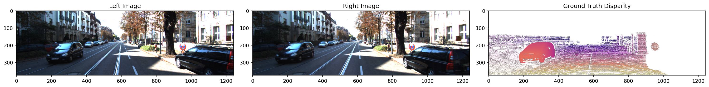
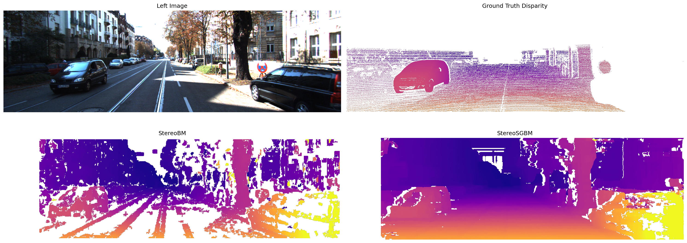
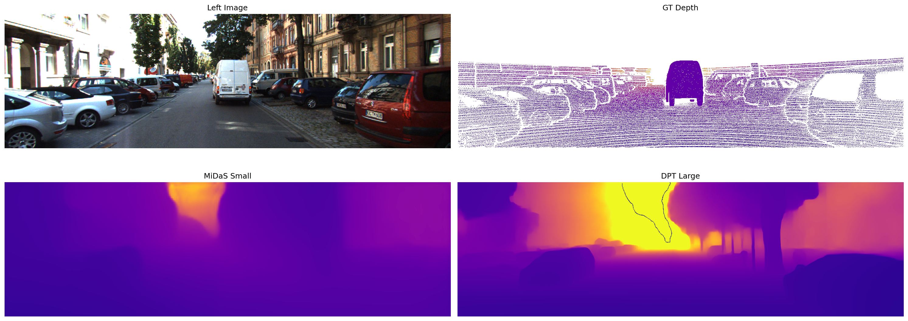
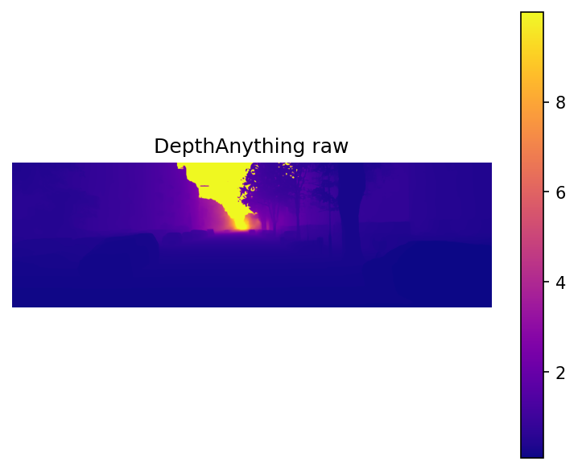
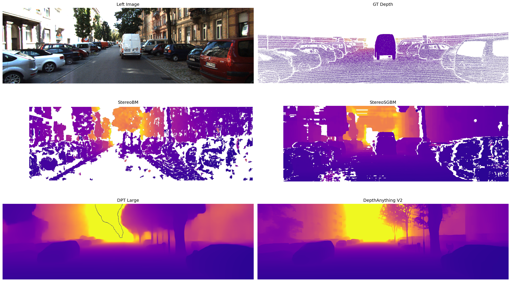

# Depth Estimation Benchmark: Stereo vs Neural Methods

**[Back to README](README.md)**

---

## 1. Overview

This project benchmarks classical stereo and neural monocular depth estimation on KITTI Stereo 2015, comparing five methods across six standard metrics. Beyond benchmarking, I fine-tuned DPT-Large on metric ground truth, exported it to ONNX with INT8 quantization, and built a bird's eye view occupancy map from the stereo depth output.

The core question was how classical stereo methods, which exploit known camera geometry, compare against learned monocular methods that estimate depth from a single image with no geometric constraints. The answer is nuanced: stereo wins on metric accuracy, neural methods win on coverage, and fine-tuning closes part of the gap.

Methods compared:
- StereoBM
- StereoSGBM
- MiDaS Small
- DPT-Large (pretrained MiDaS)
- DepthAnything V2 Small
- DPT-Large fine-tuned on KITTI

---

## 2. Dataset

I used [KITTI Stereo 2015](https://www.cvlibs.net/datasets/kitti/eval_scene_flow.php?benchmark=stereo), which contains 200 training scenes captured from a moving vehicle in Karlsruhe, Germany. Each scene provides a synchronized stereo image pair from two calibrated cameras, plus sparse ground truth (GT) depth from a Velodyne LiDAR scanner.

**Folder structure:**
```
data_scene_flow/
├── training/
│   ├── image_2/          - left camera images (000000_10.png format)
│   ├── image_3/          - right camera images
│   └── disp_occ_0/       - ground truth disparity
└── data_scene_flow_calib/
    └── training/
        └── calib_cam_to_cam/
```

Files follow the naming convention `XXXXXX_10.png` for reference frames. I only used the `_10` reference frames, not the `_11` next-frame files because because depth estimation requires only a synchronized left/right pair at one moment in time, not consecutive frames.

**Fixed-point encoding**: GT disparity is stored as uint16 PNG. Dividing by 256 gives real disparity in pixels, where KITTI multiplied by 256 before saving to preserve sub-pixel precision in integer storage. Zero values indicate no GT at that pixel. This is worth distinguishing from OpenCV's stereo output which uses a scale factor of 16 - `compute()` returns fixed-point integers where real disparity is the value divided by 16.

**GT sparsity**: There are only around 88,000 valid pixels per image out of 465,750 total (roughly 19% coverage). The LiDAR physically cannot hit the sky, so the upper ~40% of every GT depth map is always empty. Valid pixels are also biased toward close objects since nearby surfaces return stronger LiDAR signals; the GT median is around 10m even though scenes extend to 80m. This sparsity had numerous downstream consequences for both scale alignment and fine-tuning, discussed in sections 4.5 and 7.6.

**Calibration**: I read camera intrinsics from the `P_rect_00` projection matrix:
- `f = P0[0,0]` = 721.54px
- `cx = P0[0,2]` = 609.56, `cy = P0[1,2]` = 172.85
- `B = -P1[0,3] / P1[0,0]` = 0.537m, derived from the right camera matrix since `P1[0,3] = -f*B`

I verified f and B are consistent across all 200 scenes by reading every calibration file, so a single file was used throughout.

**Depth from disparity**:
```
Z = f * B / disparity
```

Depths beyond 80m and zero/negative disparities are set to NaN.



*Left camera, right camera, and ground truth disparity for scene 0. The sparse GT is visible - valid LiDAR points are scattered across the bottom portion of the image with the upper ~40% entirely empty.*

---

## 3. Stereo Pipeline

Stereo matching finds corresponding pixels between the left and right images. Since the cameras are rectified, corresponding points lie on the same horizontal scanline, so matching reduces to a 1D search along each row. The horizontal pixel shift between matched pairs is the disparity, which converts to depth via the formula above.

### 3.1 StereoBM

StereoBM (Block Matching) is the simpler of the two methods. For each pixel in the left image it takes a square block and slides it along the same row in the right image, finding the best match by minimizing the sum of absolute differences between blocks. Matching is purely local, meaning that each pixel is handled independently with no information from neighbors, which causes failures on textureless regions where all patches look similar.

I tuned parameters starting from OpenCV defaults. The main decisions:

`numDisparities=128` controls the search range. At f=721.54 and B=0.537, this covers depths from f*B/128 = 3m up to the 80m clip. I experimented with numDisparities=192 to handle closer objects but found that 128 was sufficient for KITTI's scenes.

`blockSize=11` represents the matching window size. Smaller values (tried blockSize=5) produce noisy results with too many artifacts. Larger values (tried 15) over-smooth and lose edge detail. 11 achieved a good balance between noise and boundary sharpness.

`uniquenessRatio=5` indicates that the best match must score at least 5% better than the second best, otherwise the pixel is rejected as ambiguous. The OpenCV default of 10 was too strict for KITTI, leaving too many invalid pixels in valid regions. 5 keeps more matches at the cost of some ambiguous pixels, which are cleaned up by the speckle filter.

`speckleWindowSize=80` removes isolated blobs of valid pixels smaller than this threshold after matching - these are typically noise from false matches rather than real surfaces. Values below 50 still left noise, while values above 100 started removing real detail, so I decided on 80 as the sweet spot.

`speckleRange=32` sets that pixels within 32 disparity units of each other are grouped as the same blob for speckle filtering.

`minDisparity=0` sets the search to start from zero shift.

### 3.2 StereoSGBM

StereoSGBM (Semi-Global Block Matching) adds a global smoothness constraint on top of block matching. After computing per-pixel matching costs, it aggregates costs along multiple directions with penalties for large disparity jumps between neighboring pixels. This encourages the disparity map to be smooth except at real object boundaries.

The P1 and P2 parameters control this smoothness. P1 penalizes disparity changes of 1 between neighbors; P2 penalizes larger jumps. I used the standard OpenCV formula: `P1 = 8 * 3 * blockSize^2` and `P2 = 32 * 3 * blockSize^2`, giving P1=2904 and P2=11616 with blockSize=11. The P2/P1 ratio of 4 enforces smoothness without over-smoothing real depth edges.

`mode=STEREO_SGBM_MODE_SGBM_3WAY` uses a more accurate cost aggregation scheme than the default SGBM mode. Switching to 3WAY reduced horizontal streaking artifacts visible in early results and improved edge preservation overall.

`disp12MaxDiff=1` runs a left-right consistency check - disparity is computed in both directions and pixels where results disagree by more than 1 are rejected. This catches occlusions and unreliable matches.

All other parameters (uniquenessRatio, speckleWindowSize, speckleRange) use the same values and rationale as BM.

### 3.3 Disparity to depth conversion

```python
def disp_to_depth(disp, f, B):
    with np.errstate(divide='ignore', invalid='ignore'):
        depth = f * B / disp
        depth[depth <= 0] = np.nan
        depth[depth > 80] = np.nan
    return depth
```

`np.errstate` suppresses divide-by-zero warnings since NaN handling is done explicitly on the next lines.

### 3.4 Stereo failure modes

Stereo produces invalid pixels in several predictable situations, which show up as white regions in depth maps:

- **Textureless regions**: e.g. sky, smooth roads, and plain building facades. All patches look identical so there is no unique best match
- **Occlusions**: surfaces visible in one camera but hidden behind an object in the other
- **Reflective and transparent surfaces**: e.g. windows and wet roads. Appearance changes between cameras due to specular reflection, breaking the appearance-based matching assumption
- **Repeated patterns**: e.g. fences, grilles, brick walls. Multiple equally good matches exist along the scanline
- **Image borders**: the leftmost ~128 pixels have no valid match because the corresponding points fall outside the right image's field of view given the 128-pixel search range. This is apparent through the vertical white strip on the leftmost sides of the visualizations below

Stereo produces invalid pixels rather than wrong values in such cases. On the other hand, neural methods always produce a prediction everywhere, even when wrong.

I spent a fair chunk of time tuning the parameters listed above, but still ended up with a decent amount of invalid pixels, as seen in the following visualizations. This represents a limitation of stereo, appearance-based matching.



*Ground truth disparity vs StereoBM vs StereoSGBM on scene 0. White pixels are invalid regions. SGBM produces a smoother result with better edge preservation, while BM is faster but noisier.*


*Stereo depth across 5 scenes. The invalid region patterns are consistent - sky always fails, smooth roads often fail, and the left border always has around 128 invalid columns from the field-of-view constraint.*

---

## 4. Neural Depth Estimation

Unlike stereo, monocular depth estimation takes a single image and predicts depth from learned visual cues like object size, perspective, texture gradients, and scene context. Without a second camera, there is no geometric constraint, so these models output relative depth rather than metric depth. Getting metric values requires an alignment step against ground truth.

### 4.1 MiDaS Small - tested and discarded

I included MiDaS small as a lightweight baseline to understand the accuracy tradeoff against model size. The raw output range of 0.002 to 0.025 is extremely compressed; after inversion, the depth maps showed almost no scene structure. MiDaS small is designed for real-time edge deployment and trades accuracy heavily for speed. Nonetheless, the comparison is still included in the notebook as it makes the DPT-Large improvement concrete.

### 4.2 DPT-Large

DPT-Large uses a Vision Transformer (ViT) backbone. Rather than processing through convolutional layers, ViT splits the image into 16x16 pixel patches and processes all 576 patches (for 384x384 input) simultaneously through transformer layers, where each patch attends to every other patch. This gives the model global context from the start, which is why it handles depth cues that depend on whole-scene context better than CNNs.

I loaded it via `torch.hub.load("intel-isl/MiDaS", "DPT_Large")` with the corresponding `dpt_transform`, which resizes to 384x384 and normalizes with ImageNet statistics (`mean=[0.485, 0.456, 0.406]`, `std=[0.229, 0.224, 0.225]`). These normalization values match the model's pretraining and need to be preserved during fine-tuning as well.



*MiDaS small vs DPT-Large on scene 0. MiDaS small (bottom left) shows almost no scene structure after alignment. DPT-Large (bottom right) correctly captures the road gradient and building positions.*

### 4.3 DepthAnything V2 Small

DepthAnything V2 is a newer model (2024) trained on a much larger and more diverse dataset than MiDaS. I loaded it through HuggingFace's `pipeline` interface. Despite being the Small variant, it outperforms pretrained DPT-Large on all metrics. Better training data and architectural improvements outweigh the size difference.

### 4.4 Inverse depth

Both DPT-Large and DepthAnything output inverse depth, not depth. High values mean close to the camera, while low values mean far away. This is the opposite of metric depth and needs to be handled before alignment or evaluation:

```python
depth = prediction.cpu().numpy()
depth = np.clip(depth, 1e-3, None)
depth = 1.0 / (depth + 1e-8)
```

The clip before inversion matters - near-zero raw values produce extremely large inverted values that break scale alignment. DepthAnything also has negative and near-zero values in its raw output from floating point noise, so clipping to 0.1 before inverting handles those cleanly.



*Raw DepthAnything output before inversion and alignment. High values (yellow) correspond to close objects - the opposite of metric depth. The colorbar shows values up to around 10, which after inversion and scale alignment recover metric values.*

### 4.5 Median scale alignment

Since pretrained models output relative depth in arbitrary units, I aligned them to metric scale before computing metrics using median scale alignment, which is the standard approach in depth estimation literature:

```python
def median_scale_align(pred, gt):
    mask = (gt > 0) & np.isfinite(gt) & np.isfinite(pred) & (pred > 0)
    scale = np.median(gt[mask]) / np.median(pred[mask])
    aligned = pred * scale
    aligned = np.clip(aligned, 0, 80)
    return aligned
```

The median predicted depth is scaled to match the median GT depth, giving a single global scale factor. Median is used rather than mean because it's robust to outliers.

The main challenge was KITTI's sparse GT bias. The GT median is around 10m even though scenes extend to 80m, because sparse LiDAR hits nearby surfaces more densely than far ones. This means the scale factor gets calibrated against a close-biased reference, compressing far distances after alignment. I evaluated two alternatives - linear alignment fitting scale and shift via least squares, and fitting in inverse depth space - but both gave marginal improvements that I didn't find were worth the added complexity. The far-distance limitation is measurable: for pixels where GT was greater than 30m, DPT-Large predicted an average of 3-7m after alignment. This is a fundamental constraint of single-scale alignment on sparse GT rather than a tunable parameter.

### 4.6 Inference details

After running the model, the output is interpolated back to the original image size since DPT internally processes at 384x384:

```python
prediction = torch.nn.functional.interpolate(
    prediction.unsqueeze(1),
    size=img_rgb.shape[:2],
    mode='bicubic',
    align_corners=False
)
```

`unsqueeze(1)` adds a channel dimension because interpolate expects 4D input. `squeeze()` removes it after. `torch.no_grad()` is used throughout inference since gradients aren't needed.



*All methods on scene 0. Top row: left image and GT depth. Middle row: StereoBM and StereoSGBM. Bottom row: DPT-Large and DepthAnything V2. Stereo methods have white invalid regions, while neural methods are fully dense. The plasma colormap uses vmin=0, vmax=80 consistently across all methods so colors are directly comparable.*

---

parts 5-12 coming very soon, stay tuned!
