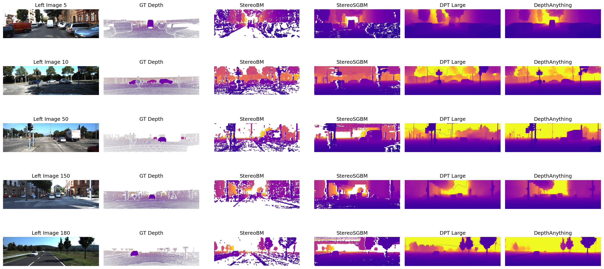
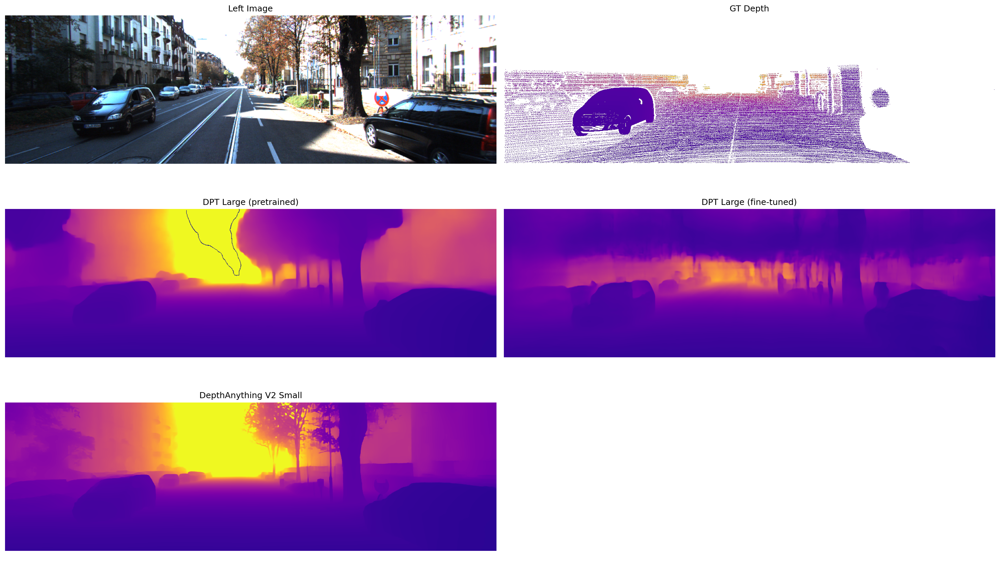
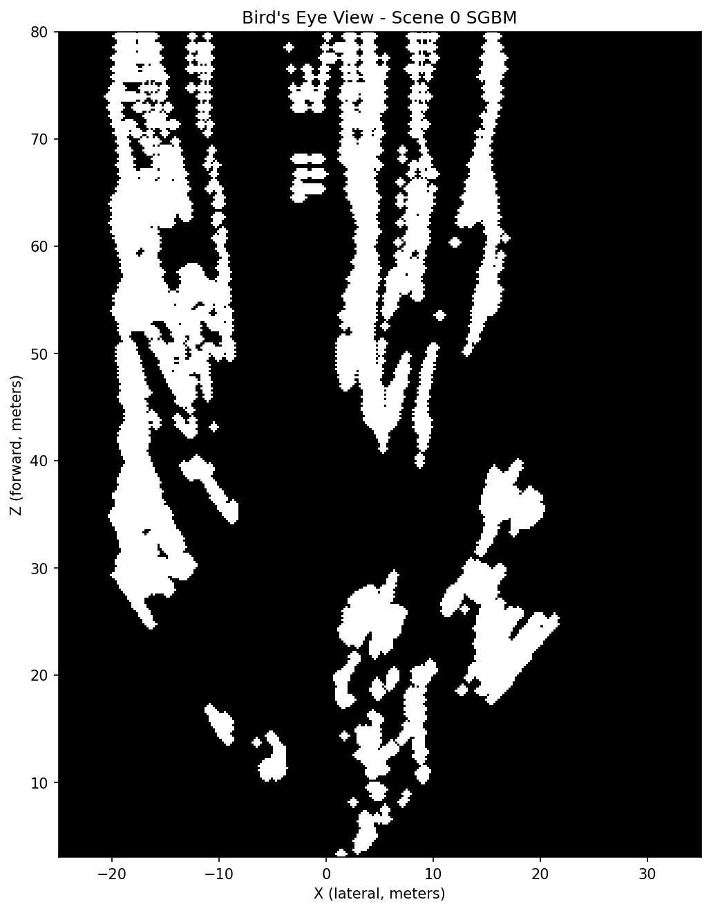
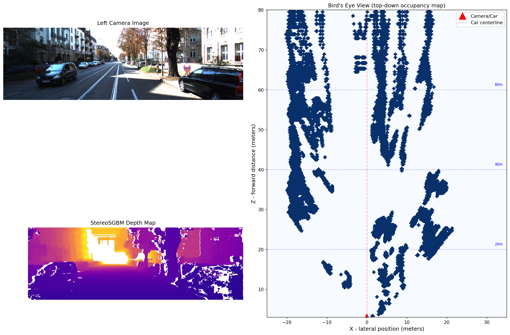

# Depth Estimation Benchmark: Stereo vs Neural Methods

**[Back to README](README.md)**

---

## 1. Overview

This project benchmarks classical stereo and neural monocular depth estimation on KITTI Stereo 2015, comparing five methods across six standard metrics. Beyond benchmarking, I fine-tuned DPT-Large on metric ground truth, exported it to ONNX with INT8 quantization, and built a bird's eye view occupancy map from the stereo depth output.

The core question was how classical stereo methods, which exploit known camera geometry, compare against learned monocular methods that estimate depth from a single image with no geometric constraints. The answer is nuanced: stereo wins on metric accuracy, neural methods win on coverage, and fine-tuning closes part of the gap.

Methods compared:
- StereoBM
- StereoSGBM
- MiDaS Small
- DPT-Large (pretrained MiDaS)
- DepthAnything V2 Small
- DPT-Large fine-tuned on KITTI

---

## 2. Dataset

I used [KITTI Stereo 2015](https://www.cvlibs.net/datasets/kitti/eval_scene_flow.php?benchmark=stereo), which contains 200 training scenes captured from a moving vehicle in Karlsruhe, Germany. Each scene provides a synchronized stereo image pair from two calibrated cameras, plus sparse ground truth (GT) depth from a Velodyne LiDAR scanner.

**Folder structure:**
```
data_scene_flow/
├── training/
│   ├── image_2/          - left camera images (000000_10.png format)
│   ├── image_3/          - right camera images
│   └── disp_occ_0/       - ground truth disparity
└── data_scene_flow_calib/
    └── training/
        └── calib_cam_to_cam/
```

Files follow the naming convention `XXXXXX_10.png` for reference frames. I only used the `_10` reference frames, not the `_11` next-frame files because because depth estimation requires only a synchronized left/right pair at one moment in time, not consecutive frames.

**Fixed-point encoding**: GT disparity is stored as uint16 PNG. Dividing by 256 gives real disparity in pixels, where KITTI multiplied by 256 before saving to preserve sub-pixel precision in integer storage. Zero values indicate no GT at that pixel. This is worth distinguishing from OpenCV's stereo output which uses a scale factor of 16 - `compute()` returns fixed-point integers where real disparity is the value divided by 16.

**GT sparsity**: There are only around 88,000 valid pixels per image out of 465,750 total (roughly 19% coverage). The LiDAR physically cannot hit the sky, so the upper ~40% of every GT depth map is always empty. Valid pixels are also biased toward close objects since nearby surfaces return stronger LiDAR signals; the GT median is around 10m even though scenes extend to 80m. This sparsity had numerous downstream consequences for both scale alignment and fine-tuning, discussed in sections 4.5 and 7.6.

**Calibration**: I read camera intrinsics from the `P_rect_00` projection matrix:
- `f = P0[0,0]` = 721.54px
- `cx = P0[0,2]` = 609.56, `cy = P0[1,2]` = 172.85
- `B = -P1[0,3] / P1[0,0]` = 0.537m, derived from the right camera matrix since `P1[0,3] = -f*B`

I verified f and B are consistent across all 200 scenes by reading every calibration file, so a single file was used throughout.

**Depth from disparity**:
```
Z = f * B / disparity
```

Depths beyond 80m and zero/negative disparities are set to NaN.


*Left camera, right camera, and ground truth disparity for scene 0. The sparse GT is visible - valid LiDAR points are scattered across the bottom portion of the image with the upper ~40% entirely empty.*

---

## 3. Stereo Pipeline

Stereo matching finds corresponding pixels between the left and right images. Since the cameras are rectified, corresponding points lie on the same horizontal scanline, so matching reduces to a 1D search along each row. The horizontal pixel shift between matched pairs is the disparity, which converts to depth via the formula above.

### 3.1 StereoBM

StereoBM (Block Matching) is the simpler of the two methods. For each pixel in the left image it takes a square block and slides it along the same row in the right image, finding the best match by minimizing the sum of absolute differences between blocks. Matching is purely local, meaning that each pixel is handled independently with no information from neighbors, which causes failures on textureless regions where all patches look similar.

I tuned parameters starting from OpenCV defaults. The main decisions:

`numDisparities=128` controls the search range. At f=721.54 and B=0.537, this covers depths from f*B/128 = 3m up to the 80m clip. I experimented with numDisparities=192 to handle closer objects but found that 128 was sufficient for KITTI's scenes.

`blockSize=11` represents the matching window size. Smaller values (tried blockSize=5) produce noisy results with too many artifacts. Larger values (tried 15) over-smooth and lose edge detail. 11 achieved a good balance between noise and boundary sharpness.

`uniquenessRatio=5` indicates that the best match must score at least 5% better than the second best, otherwise the pixel is rejected as ambiguous. The OpenCV default of 10 was too strict for KITTI, leaving too many invalid pixels in valid regions. 5 keeps more matches at the cost of some ambiguous pixels, which are cleaned up by the speckle filter.

`speckleWindowSize=80` removes isolated blobs of valid pixels smaller than this threshold after matching - these are typically noise from false matches rather than real surfaces. Values below 50 still left noise, while values above 100 started removing real detail, so I decided on 80 as the sweet spot.

`speckleRange=32` sets that pixels within 32 disparity units of each other are grouped as the same blob for speckle filtering.

`minDisparity=0` sets the search to start from zero shift.

### 3.2 StereoSGBM

StereoSGBM (Semi-Global Block Matching) adds a global smoothness constraint on top of block matching. After computing per-pixel matching costs, it aggregates costs along multiple directions with penalties for large disparity jumps between neighboring pixels. This encourages the disparity map to be smooth except at real object boundaries.

The P1 and P2 parameters control this smoothness. P1 penalizes disparity changes of 1 between neighbors; P2 penalizes larger jumps. I used the standard OpenCV formula: `P1 = 8 * 3 * blockSize^2` and `P2 = 32 * 3 * blockSize^2`, giving P1=2904 and P2=11616 with blockSize=11. The P2/P1 ratio of 4 enforces smoothness without over-smoothing real depth edges.

`mode=STEREO_SGBM_MODE_SGBM_3WAY` uses a more accurate cost aggregation scheme than the default SGBM mode. Switching to 3WAY reduced horizontal streaking artifacts visible in early results and improved edge preservation overall.

`disp12MaxDiff=1` runs a left-right consistency check - disparity is computed in both directions and pixels where results disagree by more than 1 are rejected. This catches occlusions and unreliable matches.

All other parameters (uniquenessRatio, speckleWindowSize, speckleRange) use the same values and rationale as BM.

### 3.3 Disparity to depth conversion

```python
def disp_to_depth(disp, f, B):
    with np.errstate(divide='ignore', invalid='ignore'):
        depth = f * B / disp
        depth[depth <= 0] = np.nan
        depth[depth > 80] = np.nan
    return depth
```

`np.errstate` suppresses divide-by-zero warnings since NaN handling is done explicitly on the next lines.

### 3.4 Stereo failure modes

Stereo produces invalid pixels in several predictable situations, which show up as white regions in depth maps:

- **Textureless regions**: e.g. sky, smooth roads, and plain building facades. All patches look identical so there is no unique best match
- **Occlusions**: surfaces visible in one camera but hidden behind an object in the other
- **Reflective and transparent surfaces**: e.g. windows and wet roads. Appearance changes between cameras due to specular reflection, breaking the appearance-based matching assumption
- **Repeated patterns**: e.g. fences, grilles, brick walls. Multiple equally good matches exist along the scanline
- **Image borders**: the leftmost ~128 pixels have no valid match because the corresponding points fall outside the right image's field of view given the 128-pixel search range. This is apparent through the vertical white strip on the leftmost sides of the visualizations below

Stereo produces invalid pixels rather than wrong values in such cases. On the other hand, neural methods always produce a prediction everywhere, even when wrong.

I spent a fair chunk of time tuning the parameters listed above, but still ended up with a decent amount of invalid pixels, as seen in the following visualizations. This represents a limitation of stereo, appearance-based matching.


*Ground truth disparity vs StereoBM vs StereoSGBM on scene 0. White pixels are invalid regions. SGBM produces a smoother result with better edge preservation, while BM is faster but noisier.*


*Stereo depth across 5 scenes. The invalid region patterns are consistent - sky always fails, smooth roads often fail, and the left border always has around 128 invalid columns from the field-of-view constraint.*

---

## 4. Neural Depth Estimation

Unlike stereo, monocular depth estimation takes a single image and predicts depth from learned visual cues like object size, perspective, texture gradients, and scene context. Without a second camera, there is no geometric constraint, so these models output relative depth rather than metric depth. Getting metric values requires an alignment step against ground truth.

### 4.1 MiDaS Small - tested and discarded

I included MiDaS small as a lightweight baseline to understand the accuracy tradeoff against model size. The raw output range of 0.002 to 0.025 is extremely compressed; after inversion, the depth maps showed almost no scene structure. MiDaS small is designed for real-time edge deployment and trades accuracy heavily for speed. Nonetheless, the comparison is still included in the notebook as it makes the DPT-Large improvement concrete.

### 4.2 DPT-Large

DPT-Large uses a Vision Transformer (ViT) backbone. Rather than processing through convolutional layers, ViT splits the image into 16x16 pixel patches and processes all 576 patches (for 384x384 input) simultaneously through transformer layers, where each patch attends to every other patch. This gives the model global context from the start, which is why it handles depth cues that depend on whole-scene context better than CNNs.

I loaded it via `torch.hub.load("intel-isl/MiDaS", "DPT_Large")` with the corresponding `dpt_transform`, which resizes to 384x384 and normalizes with ImageNet statistics (`mean=[0.485, 0.456, 0.406]`, `std=[0.229, 0.224, 0.225]`). These normalization values match the model's pretraining and need to be preserved during fine-tuning as well.


*MiDaS small vs DPT-Large on scene 0. MiDaS small (bottom left) shows almost no scene structure after alignment. DPT-Large (bottom right) correctly captures the road gradient and building positions.*

### 4.3 DepthAnything V2 Small

DepthAnything V2 is a newer model (2024) trained on a much larger and more diverse dataset than MiDaS. I loaded it through HuggingFace's `pipeline` interface. Despite being the Small variant, it outperforms pretrained DPT-Large on all metrics. Better training data and architectural improvements outweigh the size difference.

### 4.4 Inverse depth

Both DPT-Large and DepthAnything output inverse depth, not depth. High values mean close to the camera, while low values mean far away. This is the opposite of metric depth and needs to be handled before alignment or evaluation:

```python
depth = prediction.cpu().numpy()
depth = np.clip(depth, 1e-3, None)
depth = 1.0 / (depth + 1e-8)
```

The clip before inversion matters - near-zero raw values produce extremely large inverted values that break scale alignment. DepthAnything also has negative and near-zero values in its raw output from floating point noise, so clipping to 0.1 before inverting handles those cleanly.


*Raw DepthAnything output before inversion and alignment. High values (yellow) correspond to close objects - the opposite of metric depth. The colorbar shows values up to around 10, which after inversion and scale alignment recover metric values.*

### 4.5 Median scale alignment

Since pretrained models output relative depth in arbitrary units, I aligned them to metric scale before computing metrics using median scale alignment, which is the standard approach in depth estimation literature:

```python
def median_scale_align(pred, gt):
    mask = (gt > 0) & np.isfinite(gt) & np.isfinite(pred) & (pred > 0)
    scale = np.median(gt[mask]) / np.median(pred[mask])
    aligned = pred * scale
    aligned = np.clip(aligned, 0, 80)
    return aligned
```

The median predicted depth is scaled to match the median GT depth, giving a single global scale factor. Median is used rather than mean because it's robust to outliers.

The main challenge was KITTI's sparse GT bias. The GT median is around 10m even though scenes extend to 80m, because sparse LiDAR hits nearby surfaces more densely than far ones. This means the scale factor gets calibrated against a close-biased reference, compressing far distances after alignment. I evaluated two alternatives - linear alignment fitting scale and shift via least squares, and fitting in inverse depth space - but both gave marginal improvements that I didn't find were worth the added complexity.

### 4.6 Inference details

After running the model, the output is interpolated back to the original image size since DPT internally processes at 384x384:

```python
prediction = torch.nn.functional.interpolate(
    prediction.unsqueeze(1),
    size=img_rgb.shape[:2],
    mode='bicubic',
    align_corners=False
)
```

`unsqueeze(1)` adds a channel dimension because interpolate expects 4D input. `squeeze()` removes it after. `torch.no_grad()` is used throughout inference since gradients aren't needed.


*All methods on scene 0. Top row: left image and GT depth. Middle row: StereoBM and StereoSGBM. Bottom row: DPT-Large and DepthAnything V2. Stereo methods have white invalid regions, while neural methods are fully dense. The plasma colormap uses vmin=0, vmax=80 consistently across all methods so colors are directly comparable.*

---

## 5. Evaluation Metrics

All metrics are computed only on pixels where GT is valid (gt > 0, finite) and the prediction is positive and finite. This mask matters because GT is sparse; as mentioned earlier, 81% of pixels have no ground truth.

- **MAE**: mean absolute error in meters. Average depth error per pixel, interpretable but treats all errors equally regardless of scene depth
- **RMSE**: root mean squared error. Penalizes large errors more heavily since errors are squared before averaging
- **AbsRel**: absolute relative error: mean(|pred - gt| / gt). Normalizes by GT depth, so being 2m off on a 4m object counts as 50% error vs 5% on a 40m object
- **delta1, delta2, delta3**: percentage of pixels where max(pred/gt, gt/pred) is below a threshold. delta1 uses 1.25, delta2 uses 1.25^2, delta3 uses 1.25^3. delta1 is the strictest - it indicates that the prediction must be within 25% of GT in either direction

---

## 6. Results

All 200 KITTI Stereo 2015 training scenes were evaluated. Neural methods use per-image median scale alignment. The fine-tuned model, discussed in-depth in section 7, outputs metric depth directly with no alignment.

### 6.1 Quantitative metrics

| Method | MAE | RMSE | AbsRel | delta1 | delta2 | delta3 |
|--------|-----|------|--------|--------|--------|--------|
| StereoBM | 1.201 | 3.465 | 0.055 | 0.971 | 0.985 | 0.990 |
| StereoSGBM | 1.175 | 3.759 | 0.059 | 0.965 | 0.983 | 0.990 |
| DPT-Large (pretrained) | 2.541 | 5.475 | 0.127 | 0.861 | 0.962 | 0.986 |
| DepthAnything V2 Small | 2.154 | 5.414 | 0.105 | 0.912 | 0.976 | 0.989 |
| DPT-Large (fine-tuned) | 2.053 | 4.366 | 0.103 | 0.887 | 0.972 | 0.992 |

Lower is better for MAE, RMSE, AbsRel. Higher is better for delta metrics.

**Stereo wins on metric accuracy.** Both stereo methods significantly outperform all neural methods on MAE and AbsRel. The reason is fundamental: stereo uses real camera geometry and known calibration to compute metric depth directly. On the other hand, neural methods output relative depth that needs scale alignment, which is inherently imperfect, especially at far distances. However, neural methods outperformed stereo methods on RMSE, which is likely due to SGBM's smoothness constraing forcing large disparity jumps at object boundaries, creating bigger individual errors that the squaring amplifies.

**DepthAnything beats pretrained DPT-Large despite being smaller.** DepthAnything V2 Small achieves better AbsRel (0.105 vs 0.127) and better deltas. Training data scale and architectural improvements outweigh the model size difference.

**Neural methods are always dense, stereo has holes.** Stereo produces invalid pixels in textureless regions. Neural methods always produce a prediction everywhere even if wrong. This presents a tradeoff depending on the downstream task, since stereo's invalid pixels are honest, while neural methods' dense predictions are useful for tasks requiring complete depth maps.

**Fine-tuning improved all metrics.** Fine-tuned DPT-Large improved over pretrained across every metric: MAE 2.541 to 2.053 (19% improvement), AbsRel 0.127 to 0.103 (19% improvement). It also beats pretrained DepthAnything on MAE and RMSE, showing that domain-specific fine-tuning can close the gap against a stronger pretrained model. DepthAnything still (just barely) wins on delta1 and delta2.

### 6.2 Qualitative metrics

I selected five scenes for the qualitative comparison to cover a range of driving conditions:

- scene 5: tight urban street with parked cars on both sides - good for close-range depth
- scene 10: open intersection with multiple cars at different depths and thin structures like traffic lights - good failure case for stereo on thin objects
- scene 50: wide road with a truck and lots of sky - clear example of stereo sky and textureless region failure
- scene 150: urban with a visible cyclist - shows how each method handles a small close object against far background
- scene 180: open rural highway with distant mountains - shows far depth range behavior, another good example of stereo textureless region failure on sky and road

The results each demonstrate common pitfalls and advantages of stereo vs neural models, and are visualized below.



*5-scene comparison across all methods. Each row is one scene (5, 10, 50, 150, 180). Columns: left image, GT depth, StereoBM, StereoSGBM, DPT-Large, DepthAnything V2.*

---

## 7. PyTorch Fine-Tuning

The pretrained DPT-Large model outputs relative inverse depth and needs median scale alignment to get metric values. Fine-tuning it directly on KITTI with metric ground truth teaches the model to output meters directly, removing the need for alignment and improving accuracy on driving scenes specifically.

### 7.1 Training setup

I trained on Kaggle with a T4 GPU (15GB VRAM), which has a 30hr/week GPU quota.

Training config:
- model: DPT-Large
- epochs: 15
- batch size: 2 (batch 4 risked OOM on 15GB VRAM with DPT-Large)
- learning rate: 1e-4 with Adam optimizer
- loss: HuberLoss(delta=1.0)
- split: 160 train / 40 val, random seed 42

I chose Huber loss rather than pure L2 (MSE) because depth errors on KITTI can be very large - predicting 5m for a 50m object is a 45m error that would dominate MSE and destabilize training. Huber behaves like L2 for small errors and L1 for large errors, making it more robust to the outliers that sparse LiDAR GT produces.

I chose not to fine-tune DepthAnything V2 even though it was the stronger pretrained model. DPT-Large was already benchmarked and I wanted to test whether domain-specific fine-tuning could close the architecture gap. As shown above, it did! Fine-tuned DPT-Large (AbsRel 0.103) beats pretrained DepthAnything (0.105). Fine-tuning DepthAnything would likely give even better results and is a natural next step that I'd like to explore sometime.

### 7.2 Dataset class

```python
class KITTIDepthDataset(Dataset):
    def __getitem__(self, idx):
        left_path, _, disp_path = self.triplets[idx]

        img = cv2.imread(str(left_path))
        img = cv2.cvtColor(img, cv2.COLOR_BGR2RGB)

        disp_gt = cv2.imread(str(disp_path), cv2.IMREAD_UNCHANGED).astype(np.float32) / 256.0
        disp_gt[disp_gt == 0] = np.nan
        depth_gt = disp_to_depth(disp_gt, f, B)
        depth_gt = np.nan_to_num(depth_gt, nan=0.0)
        depth_gt = cv2.resize(depth_gt, (384, 384), interpolation=cv2.INTER_NEAREST)

        if self.transform:
            img = self.transform(img)

        return img, torch.tensor(depth_gt, dtype=torch.float32)
```

GT depth is resized to 384x384 using `INTER_NEAREST` rather than bicubic. The GT is sparse; numerically, it's mostly zeros with valid values scattered around. Bicubic interpolation would average valid depth pixels with surrounding zeros, creating fake intermediate values at invalid pixel locations. Nearest-neighbour preserves the sparse structure by copying the closest valid pixel.

NaN values are replaced with 0 before resizing since NaN arithmetic would corrupt the resize. The training loss uses `mask = depths > 0` to ignore these zero pixels so they never contribute to gradient updates.

The pretrained `dpt_transform` adds a batch dimension internally, which conflicts with DataLoader's own batching. I wrote a custom transform that returns a clean (3, 384, 384) tensor instead:

```python
train_transform = T.Compose([
    T.ToPILImage(),
    T.Resize((384, 384)),
    T.ToTensor(),
    T.Normalize(mean=[0.485, 0.456, 0.406], std=[0.229, 0.224, 0.225])
])
```

The normalization values match DPT-Large's pretraining statistics.

### 7.3 Training loop

The key parts of the training loop:

```python
pred = model(imgs)
if pred.dim() == 3:
    pred = pred.unsqueeze(1)
pred = torch.nn.functional.interpolate(
    pred, size=depths.shape[1:],
    mode='bicubic', align_corners=False
).squeeze(1)

mask = depths > 0
loss = criterion(pred[mask], depths[mask])

optimizer.zero_grad()
loss.backward()
optimizer.step()
```

Loss is computed only on valid GT pixels using the mask. I logged training and validation loss plus validation AbsRel to W&B every epoch, and saved a checkpoint whenever validation loss improved. In hindsight, AbsRel would probably have been a more meaningful metric, but in practice, they tracked closely enough that the best loss checkpoint also had the best AbsRel.

### 7.4 Training results and checkpoint management

Training ran across multiple Kaggle sessions. Results varied between runs - best val_absrel ranged from 0.109 to 0.097 - which is expected with only 160 training images (small dataset effect) and non-determinism in GPU batch ordering even with a fixed random seed. The model can converge to different local optima depending on which examples it sees first.

An important operational lesson here was checkpoint management. Re-running the notebook with the same `SAVE_PATH` overwrites the previous checkpoint, meaning a better run can be lost to a worse one. The fix was to call `wandb.save(SAVE_PATH)` immediately after `torch.save()` to upload checkpoints to W&B cloud before the Kaggle session ended.

The final checkpoint had val_absrel 0.097 during training and 0.103 on the full 200-image evaluation. This difference was expected - training AbsRel was computed on 40 val images during the forward pass, while final evaluation used the full inference pipeline on all 200 scenes.

Best run results by epoch:

| Epoch | Train loss | Val loss | Val AbsRel |
|-------|-----------|----------|------------|
| 1 | 4.789 | 2.852 | 0.183 |
| 2 | 2.895 | 2.458 | 0.157 |
| 5 | 1.639 | 2.048 | 0.143 |
| 8 | 1.269 | 1.921 | 0.128 |
| 9 | 1.295 | 1.683 | 0.113 |
| 11 | 1.089 | 1.659 | 0.112 |
| 14 | 0.963 | 1.580 | 0.098 |

Loss decreased consistently through epoch 5, plateaued around epochs 6-8, then improved again through epoch 14. What seemed to be slight overfitting appeared after epoch 14, and this was more evident in other sessions' runs where loss increased more after runs 11-13. The best checkpoint for this run occurred at epoch 14.

### 7.5 Pretrained vs fine-tuned inference

The pretrained model outputs inverse depth and needs median scale alignment. The fine-tuned model outputs metric depth directly and needs neither inversion nor alignment because training against metric GT in meters taught the model to output meters. These require separate inference functions:

- `run_midas()` - for pretrained: inverts raw output, then applies median scale alignment
- `run_midas_finetuned()` - for fine-tuned: uses raw output directly, no inversion or alignment

### 7.6 Sky degradation artifact

The fine-tuned model predicts mid-range depth (~17m) for sky and upper image regions, while the pretrained model correctly predicts sky as far (pushing toward 80m). This is visible in the visualization as dark purple in the top portion of the fine-tuned depth map vs yellow-orange in the pretrained map.

The cause is the sparse LiDAR GT. The upper ~40% of every training image has no valid GT pixels, so the fine-tuning loss had no gradient signal from that region. The pretrained sky-depth knowledge in those weights got gradually overwritten by updates driven entirely by the supervised bottom 60%. This is a known issue with fine-tuning on sparse supervision - the model degrades in regions that were never supervised.

This doesn't affect the reported metrics since evaluation also masks out those same invalid pixels. However, it would hurt real-world performance where full-image depth matters.



*Pretrained DPT-Large vs fine-tuned DPT-Large vs DepthAnything V2 on scene 0. Sky degradation in the fine-tuned model is visible in the top portion - pretrained correctly shows sky as far (yellow/orange) while fine-tuned shows it as mid-range (dark purple). The fine-tuned model shows generally better metric depth in the supervised lower portion of the image.*

---

## 8. ONNX Export and Quantization

### 8.1 Why ONNX

A PyTorch `.pth` checkpoint requires PyTorch, the MiDaS source code, and custom loading code to run. An ONNX file is a self-contained universal format that only needs `onnxruntime` (around 50MB) to run anywhere, including C++, mobile, embedded systems, and any other frameworks. For robotics deployment on a Jetson or Raspberry Pi, removing the full PyTorch dependency is a practical win.

ONNX export works by tracing the model - it runs it once with a dummy input and records every operation (e.g. attention, convolution, layer normalization, interpolation) while doing so. The dummy input values don't matter, only the shape (1, 3, 384, 384). The result is a computation graph saved to disk. 

### 8.2 Export challenges with DPT-Large

DPT-Large's ViT backbone computes the unflatten size dynamically from the input tensor shape:

```python
h, w = x.shape[-2:]
unflatten_size = [h // patch_size, w // patch_size]  # h and w are tensors, not ints
```

The ONNX tracer sees a tensor expression rather than a concrete integer. Even though the values are always 24 and 24 (384x384 input, patch_size=16), the tracer can't resolve this at export time and refuses to proceed. Working through the export required addressing three separate issues:

- the new dynamo exporter (default in PyTorch 2.9+) failed on the unflatten operation
- the old TorchScript exporter (`dynamo=False`) hit the same root cause
- reloading the model on CPU still left some internal activation tensors on GPU since they're stored as non-parameters and don't move with `.cpu()`

A useful diagnostic was that an early export attempt appeared to succeed and produced a file, but it was only 1.8MB. DPT-Large should be around 1.4GB. Checking file size revealed the export had silently produced a degraded stub, so it's worth verifying output file size any time an ONNX export seems suspiciously fast.

The fix required patching the MiDaS source file directly:

```python
# in ~/.cache/torch/hub/intel-isl_MiDaS_master/midas/backbones/utils.py
# changed:
h // pretrained.model.patch_size[1]
# to:
int(h) // int(pretrained.model.patch_size[1])
```

`int()` forces Python to evaluate the tensor immediately and extract a concrete integer that ONNX can handle as a static shape. I then reloaded the model fresh with `map_location='cpu'` (never moving to GPU first) to ensure all internal tensors were on CPU from the start. The model cache was cleared manually through `sys.modules` to pick up the patched source without re-downloading, since re-downloading would overwrite the patch.

The final successful export produced a 1367.7MB file - the correct size for DPT-Large.

### 8.3 INT8 quantization

After successful ONNX export, I quantized to INT8:

```python
quantize_dynamic(
    "dpt_large_finetuned.onnx",
    "dpt_large_finetuned_int8.onnx",
    weight_type=QuantType.QInt8
)
```

Dynamic quantization converts stored weights from 32-bit floats to 8-bit integers ahead of time, while activations are quantized at runtime. This is simpler than static quantization which requires a calibration dataset.

| Model | Size (MB) | Inference time (ms) | Speedup |
|-------|-----------|---------------------|---------|
| DPT FP32 | 1367.7 | 2859 | 1.0x |
| DPT INT8 | 351.5 | 5425 | 0.53x |

The 4x size reduction is as expected. The INT8 model being slower on CPU was surprising but seemed to be a common finding: INT8 speedup requires hardware with native INT8 compute units like GPU Tensor Cores or mobile NPUs. On CPU, the runtime has to dequantize weights back to float before arithmetic, and that overhead outweighs the INT8 savings. On a Jetson with CUDA or TensorRT the INT8 model would likely be around 2x faster. Nonetheless, even without a speed benefit, the size reduction (1368MB to 352MB) matters for memory-constrained deployment.

---

## 9. Bird's Eye View Occupancy Map

### 9.1 What BEV is and why it matters

A bird's eye view (BEV) occupancy map is a top-down 2D grid where each cell is marked as occupied or empty based on detected 3D points. Autonomous vehicle systems use BEV feature maps as input to CNNs for path planning, obstacle detection, and driveable space prediction. The 2D grid format is easy for networks to process regardless of where obstacles appear in the image.

My implementation projects stereo depth to a top-down occupancy grid using the pinhole camera model, giving obstacle positions in real-world coordinates relative to the car.

### 9.2 3D projection math

For each pixel (u, v) with known depth Z, the real-world 3D position is:

```
X = (u - cx) * Z / f    - lateral position (left/right) in meters
Y = (v - cy) * Z / f    - vertical position (up/down) in meters
Z = depth               - forward distance in meters
```

Dividing by f converts pixel offset from the optical center to an angle, and multiplying by Z gives real-world distance. In KITTI's coordinate convention, Y is positive downward (pixel rows increase downward), so the road surface (camera mounted at ~1.65m above ground) has positive Y around +1.65, and sky has negative Y. For BEV I use only X (lateral) and Z (forward).

### 9.3 Grid construction

```python
def depth_to_bev(depth, f, cx, cy, grid_res=0.2, x_range=(-25, 35), z_range=(3, 80)):
    valid = np.isfinite(depth) & (depth > 0)
    Z = depth[valid]
    X = (uu[valid] - cx) * Z / f
    Y = (vv[valid] - cy) * Z / f

    height_mask = (Y > -5) & (Y < 0.5)
    Z, X = Z[height_mask], X[height_mask]

    xi = ((X - x_range[0]) / grid_res).astype(int)
    zi = ((Z - z_range[0]) / grid_res).astype(int)

    mask = (xi >= 0) & (xi < x_bins) & (zi >= 0) & (zi < z_bins)
    grid[zi[mask], xi[mask]] = 1
    return grid
```

The height filter `(Y > -5) & (Y < 0.5)` removes the road surface (Y ~+1.65, below camera) and sky (very negative Y), keeping obstacle-height points like cars, buildings, and poles. I set x_range and z_range based on printing actual 3D coordinate bounds from a test scene: X ran from -23.1 to 30.4m, and Z from 3.3 to 79.5m.

Grid resolution of 0.2m per cell gave cleaner results than 0.1m as finer resolution amplified stereo depth errors into noise. After building the binary grid, `binary_dilation(bev, iterations=2)` expands each occupied region by 2 pixels in all directions, filling small gaps and making the map more readable.

I also tried building BEV from neural depth. Results were noticeably worse - neural depth after scale alignment isn't geometrically precise enough for accurate 3D projection, and the height filter doesn't separate ground from obstacles as cleanly because neural depth doesn't preserve real-world spatial distributions the way stereo geometry does.

### 9.4 Results

The scene 0 BEV roughly shows the urban structure: a dark corridor down the center (road, empty space), white regions at around X = -15m and X = +15m (buildings on both sides), and blobs near the bottom (parked cars close to the camera). The result, shown below, isn't ideal. I believe that this is a result of numerous factors: for example, stereo depth errors compound when projecting to 3D, and the height filter is a blunt instrument that misclassifies road pixels as obstacles and vice versa. A cleaner result would require denser, more accurate depth (e.g. from LiDAR or a learned stereo network like RAFT-Stereo) and a proper ground plane estimation instead of a fixed Y threshold."



*Simple bird's eye view of scene 0. Dark = empty space (road), white/blue = occupied (buildings, cars, poles). Camera is at bottom center, road extends upward, buildings are on both sides.*



*Annotated BEV visualization. Left: RGB image and SGBM depth map. Right: BEV with camera position marker, centerline, and distance reference rings at 20m, 40m, 60m.*

---

## 10. Failure Analysis

### 10.1 Stereo failures

Stereo's invalid pixels cluster in predictable regions. Scene 50 and 180 are the clearest examples - wide open road with large sky regions - and both stereo methods have almost entirely invalid depth in the upper half. Smooth asphalt also frequently fails because consistent color gives the block matcher nothing to distinguish between positions.

The leftmost ~128 columns are always invalid because those pixels fall outside the stereo search range - the matcher can only look up to 128 pixels to the right in the right image, so anything beyond that has no valid match.

Quantitatively, BM's AbsRel is marginally better than SGBM (0.055 vs 0.059) even though SGBM looks cleaner visually. The smoothness constraint in SGBM, while improving visual quality, slightly redistributes errors in a way that hurts pixel-level accuracy metrics.

### 10.2 Neural depth failures

The clearest failure is at far distances. After median scale alignment, far depth gets compressed - the scale factor is calibrated against the GT median which is biased toward close-range pixels, so everything beyond ~30m gets pulled toward mid-range predictions. This is a direct consequence of the alignment bias described in section 4.5.

DepthAnything and DPT-Large produce qualitatively similar depth maps, with DepthAnything slightly sharper on thin structure boundaries. The metric gap (AbsRel 0.105 vs 0.127) is consistent with the visual quality difference.

### 10.3 Fine-tuning failures

The fine-tuned model's sky degradation is immediately visible, especially when placed side-by-side with the pretrained model. The pretrained model shows the upper region as yellow-orange (far, correct). The fine-tuned model shows it as dark purple (mid-range, wrong), predicting around 17m for pixels that are effectively at infinity. The upper half of the fine-tuned depth map has a mean prediction of 17.6m vs the pretrained model's upper half pushing toward 80m.

This doesn't show up in the reported metrics because evaluation masks out those same pixels. However, it would be a real problem in deployment - systems using this model for obstacle avoidance would get wrong depth estimations for the upper portion of every scene.

### 10.4 BEV limitations

Beyond the horizontal noise bands from scanline-independent stereo matching, stereo BEV only covers what the forward camera sees, thus no information about sides, rear, or behind occluding objects. LiDAR gives 360-degree coverage with precise sparse point clouds, which is why real AV systems use LiDAR as the primary BEV sensor. The BEV here demonstrates the correct geometric pipeline for camera-based depth projection, but it's not a substitute for LiDAR-based mapping.

---

## 11. Limitations and Future Work

Several directions would meaningfully improve on the work done for this project:

**Fine-tuning DepthAnything V2 instead of DPT-Large** is the most obvious next step. DepthAnything V2 Small outperforms pretrained DPT-Large (AbsRel 0.105 vs 0.127) before any fine-tuning. Applying the same KITTI fine-tuning to a stronger base model would almost certainly produce better final results than fine-tuned DPT-Large at 0.103.

**Fixing the sky degradation** is the most important quality improvement for the fine-tuned model. Training with a masked loss that explicitly preserves pretrained predictions in unsupervised regions (where GT depth is zero) would prevent the pretrained sky knowledge from being overwritten. Alternatively, freezing the upper portion of the image entirely during training would have the same effect.

**Stereo-neural fusion** would address both methods' weaknesses simultaneously. Stereo is accurate where it's valid but has many holes; neural depth is always dense but metrically imprecise. A confidence-weighted fusion - using stereo depth where it's valid and neural depth to fill holes - would produce a dense, roughly metric depth map. The stereo validity mask provides a natural confidence signal.

**Real INT8 speedup** requires running on hardware with native INT8 support. Deploying the ONNX model on a Jetson with TensorRT using `CUDAExecutionProvider` would give the ~2x speedup that CPU inference couldn't deliver. Static quantization with a small KITTI calibration set would also give better accuracy than the dynamic quantization used here.

**Temporal consistency for BEV** is important for real AV applications. The current BEV is computed frame-by-frame with no memory across frames. Fusing depth estimates with IMU odometry and projecting prior frames into the current frame would give a running accumulated occupancy map rather than a single-frame snapshot.

---

## 12. W&B Experiment Tracking

I used Weights and Biases to track training and log all evaluation results. During fine-tuning, I logged train loss, validation loss, validation AbsRel, and learning rate on each epoch. After evaluation, I retroactively logged all five methods as separate W&B runs with their full metric dictionaries, producing side-by-side comparison graphs in the dashboard.

[W&B dashboard](https://wandb.ai/emlyqi-team/depth_benchmarking)
